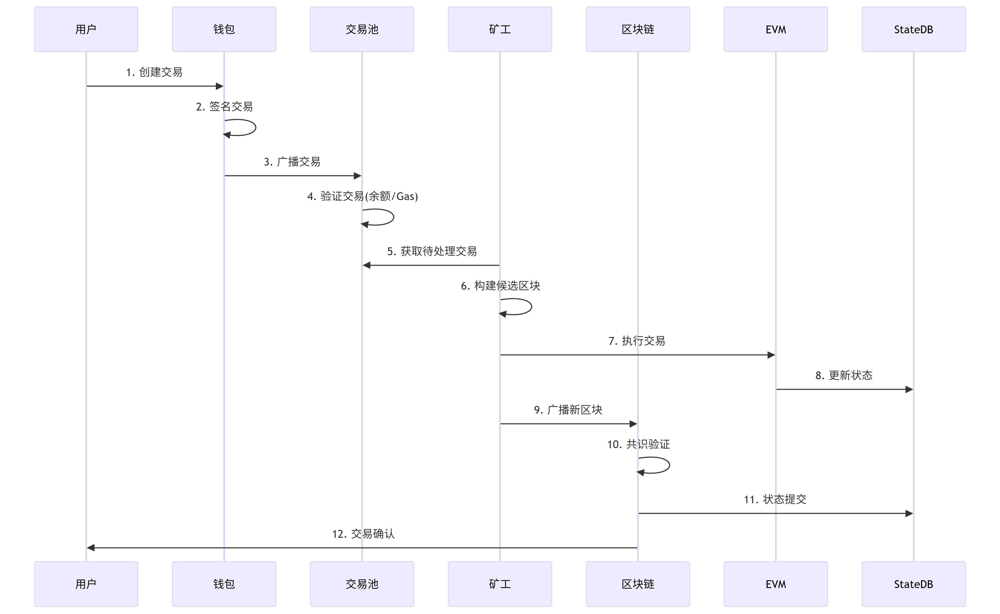

## Go-Ethereum 核心功能与架构设计研究作业

### 一、理论分析

#### 1.阐述Geth在以太坊生态中的定位
Geth（go-ethereum）是以太坊的 Go 实现——进入去中心化网络的门户。Geth 是最初的以太坊实现之一，使其成为最久经沙场和考验的客户端。Geth 是一个以太坊执行客户端 ，这意味着它处理智能合约的交易、部署和执行，并包含一台称为以太坊虚拟机的嵌入式计算机。将 Geth 与共识客户端一起运行，将计算机变成以太坊节点。

#### 2.解析核心模块交互关系：
  区块链同步协议（eth/62,eth/63）
  协议里主要同步的数据：包括获取区块头、区块体、以及交易消息，状态消息等以及新块的hash数据，并且使用rlp算法进行编解码。

  节点的发现和链接建立：
    1）节点通过peer.go中的Handshake方法进行握手，并发送状态数据，包括：协议版本、网络id、当前区块、创世区块；
    并且读取对方的状态数据并进行验证
  协议消息处理流程：
    1）同步状态数据
    2) 同步区块数据
    3）同步交易数据
  区块链同步：
    1）主要使用downloader模块进行区块头、区块体、节点数据、交易收据

交易池管理与Gas机制
 1)对于提交的交易，首先添加到交易池里面，并且对交易中的gas等相关参数进行验证，如果验证通过，则添加到交易池中，否则返回错误。
 2)交易池中交易按照gas价格进行排序，然后按照顺序执行，执行过程中，如果交易执行失败，则返回错误，否则返回交易执行结果。
 3)Gas机制：
  1）Gas是交易执行的单位，Gas的计量单位是wei，1wei = 10^-18 ether。
  2）Gas的计算公式：gas = gas_limit * gas_price


EVM执行环境构建
  1）构建一个EVM实例，包括区块上下文、交易上下文、状态数据库、配置、链配置、链规则
  2）EVM是一个基于栈的虚拟机，主要执行交易和合约，基于字节码进行操作
  3）EVM接收交易数据
  4）构建上下文
  5）执行交易
  6）状态更新
  6）返回结果


共识算法实现（Ethash/POS）
  Ethash算法实现
  1）根据给定的区块头的难度值，以及nonce随机值，计算一个hash，不断调整nonce值，直到得到一个满足难度值的hash
  2）将计算得到的hash作为区块的hash值，将nonce值作为区块的nonce值
  3）提交区块

  POS算法实现
    1）权益证明算法，除了之前的执行客户端，还需要启动一个共识客户端，如果是作为验证者，还需要一个验证者客户端
    2）验证者客户端负责执行交易、验证交易、状态更新；共识客户端负责进行区块的提议和验证
    3）验证者客户端在成为验证者之前，需要向以太坊的一个固定的合约中存入32个ETH，并且加入待激活的队列，用以限制新验证者加入网络的速度。激活以后，可以从对等节点中接收新区块，并且重新执行区块交易，验证区块签名，然后验证者向整个网络发送对该区块的投票（证明）。
    4）在权益证明的以太坊中，时间被划分为slot（12 秒）和epoch（32 个区块）。每个区块中会随机选择一个验证者作为区块提议者。该验证者负责创建新区块并将其发送到网络中的其他节点。此外，每个区块中还会随机选择一组验证者组成委员会，其投票结果用于确定提议区块的有效性。
    5）用户通过私钥对自己的交易进行签名，并进行交易的发送。交易里还包括给验证者的gas费用。在提交交易之前，用户还要确认自己的账户由足够的ETH来完成交易
    6）交易有效，将交易添加到本地mempool中，并通过执行层广播网络向其他节点广播。其他节点接收到交易，也会先添加到自己本地的memppool中。
    7)前面的slot中，每个slot都一个验证者为当前的提议者，他们是随机选择出来的。该节点负责构建并广播要添加的下一个区块，并更新全局状态。
    8）该节点的执行客户端，将本地mempool中的交易打包成一个“执行有效负载”，并在本地执行。同时这些信息也传递给共识客户端，在共识客户端“执行有效负载”被包装成“beacon block”,里面也包含奖励、惩罚、认证等信息。
    9）其他节点通过共识层的广播网络接收到“beacon block”，并且把他们交给执行客户端，在本地重新执行交易。验证客户端随后验证该区块有效，并且是它所看到的链中的逻辑下一个区块，每个确认节点都把该区块添加到本地数据库中。
    10)如果交易包含两个检查点，则可以确定该交易已最终确定。

### 二、架构涉及
#### 1、绘制分层架构图


各层关键模块说明：
1、P2P网络层
LES (轻节点协议)：轻量级以太坊子协议，允许轻节点仅同步区块头而非完整区块链
2、区块链协议层
core/types：定义核心数据结构

```go
type Header struct {
    ParentHash  common.Hash
    UncleHash   common.Hash
    Coinbase    common.Address
    Root        common.Hash  // 状态树根
    TxHash      common.Hash  // 交易树根
    ReceiptHash common.Hash  // 收据树根
    Bloom       Bloom
    Difficulty  *big.Int
    Number      *big.Int
    GasLimit    uint64
    GasUsed     uint64
    Time        uint64
}
```
3、状态存储层
trie：默克尔帕特里夏树实现，
三种节点类型：分支节点（17元素）、扩展节点（key-path, value）、叶子节点（key-end, value）

交易生命周期流程图：


账户状态存储模型：


```
账户结构：
Nonce：交易计数器（EOA）或合约创建次数
Balance：ETH余额（wei单位）
StorageRoot：合约存储树的Merkle根
CodeHash：合约字节码的Keccak256哈希
```
```
状态树：
使用Modified Merkle Patricia Trie (MPT)
键：20字节账户地址的Keccak256哈希
值：RLP编码的账户数据
```
```
存储树：
每个合约独立维护MPT
键：32字节存储槽的Keccak256哈希
值：32字节数据
```
```
持久化：
状态树根哈希存储在区块头
LevelDB中存储树节点数据
通过Journaling实现状态回滚
```